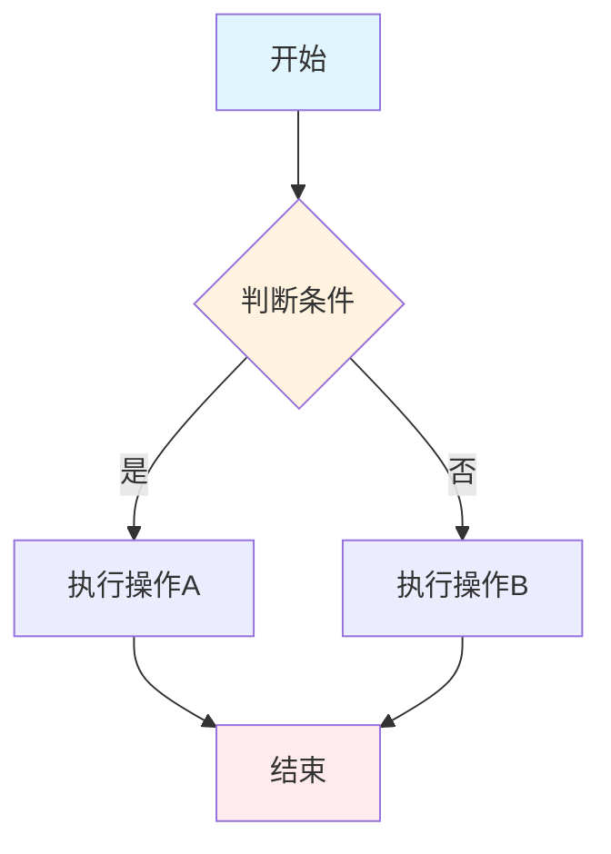
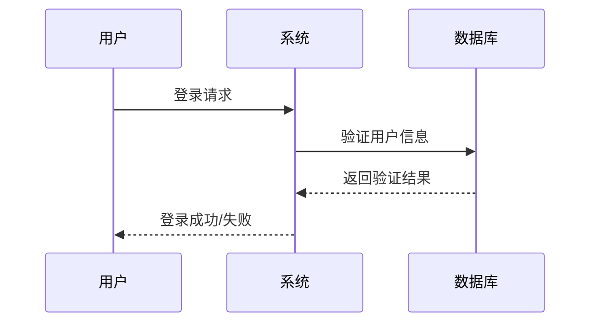
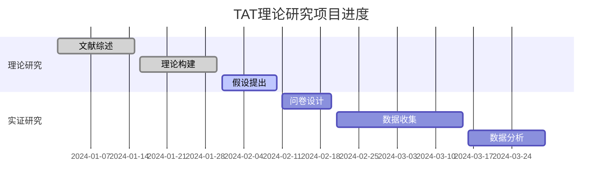
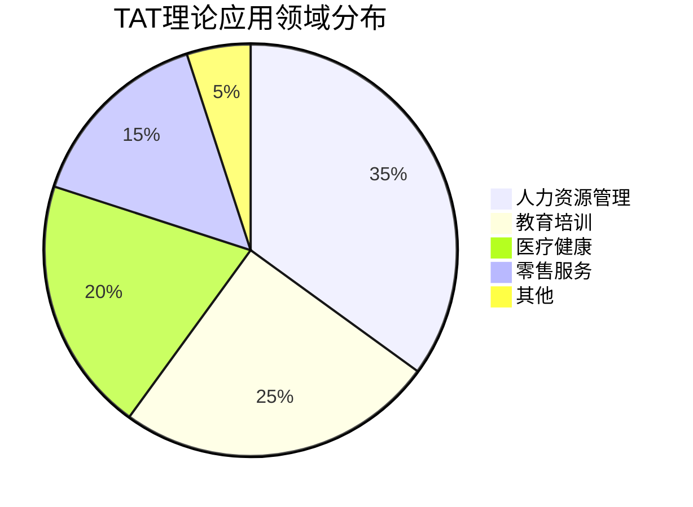

# Mermaid图表测试文档

## 流程图测试

```mermaid
graph TD
    A[开始] --> B{判断条件}
    B -->|是| C[执行操作A]
    B -->|否| D[执行操作B]
    C --> E[结束]
    D --> E
    
    style A fill:#e1f5fe
    style E fill:#ffebee
    style B fill:#fff3e0
```

## 序列图测试

```mermaid
sequenceDiagram
    participant U as 用户
    participant S as 系统
    participant D as 数据库
    
    U->>S: 登录请求
    S->>D: 验证用户信息
    D-->>S: 返回验证结果
    S-->>U: 登录成功/失败
```

## 甘特图测试

```mermaid
gantt
    title TAT理论研究项目进度
    dateFormat  YYYY-MM-DD
    section 理论研究
    文献综述           :done,    des1, 2024-01-01,2024-01-15
    理论构建           :done,    des2, 2024-01-16,2024-01-30
    假设提出           :active,  des3, 2024-01-31,2024-02-10
    section 实证研究
    问卷设计           :         des4, 2024-02-11,2024-02-20
    数据收集           :         des5, 2024-02-21,2024-03-15
    数据分析           :         des6, 2024-03-16,2024-03-30
```

## 饼图测试

```mermaid
pie title TAT理论应用领域分布
    "人力资源管理" : 35
    "教育培训" : 25
    "医疗健康" : 20
    "零售服务" : 15
    "其他" : 5
```

这个测试文档包含了多种类型的Mermaid图表，用于验证渲染功能是否正常工作。