# TAT理论研究方法论

## 一、研究方法论框架

### 1.1 研究哲学基础

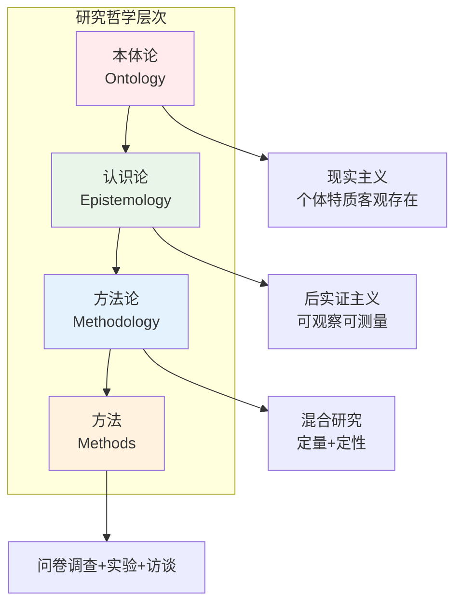

### 1.2 研究设计类型学

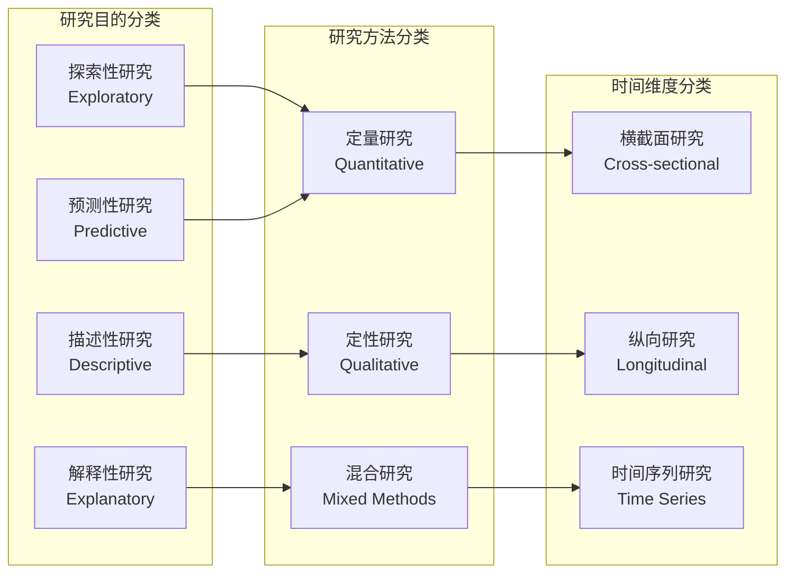

## 二、数据收集方法

### 2.1 量化数据收集流程

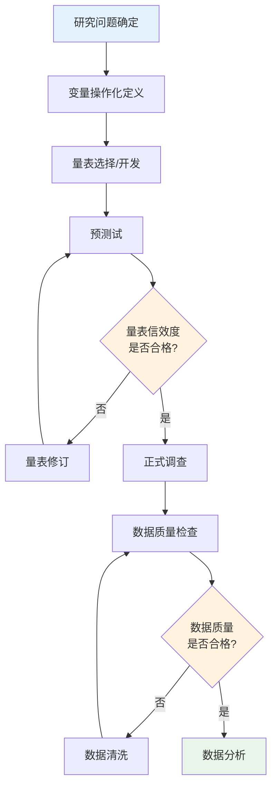

### 2.2 质性数据收集策略

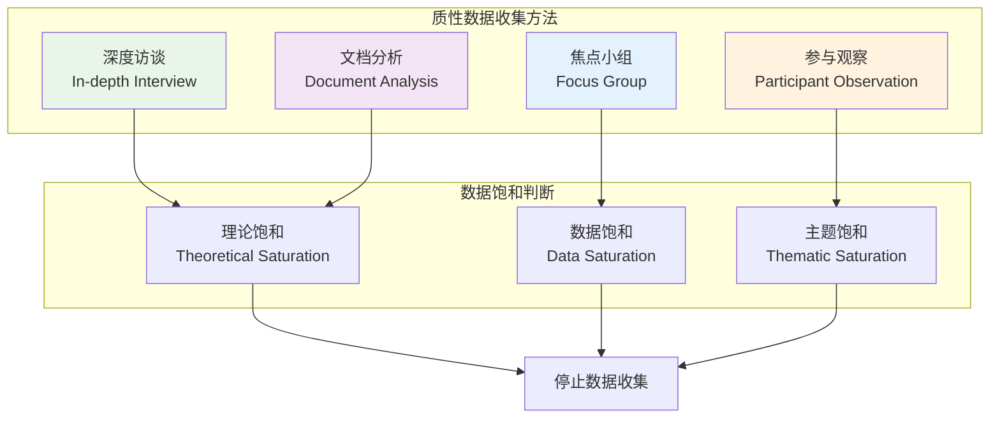

### 2.3 混合研究设计模式

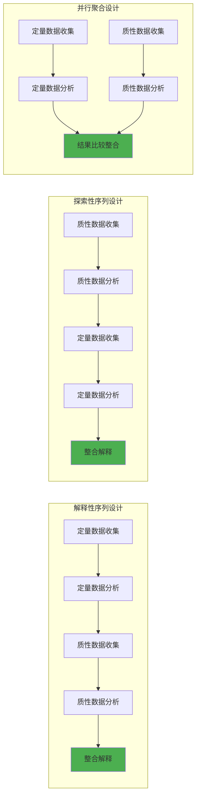

## 三、数据分析技术

### 3.1 描述性统计分析

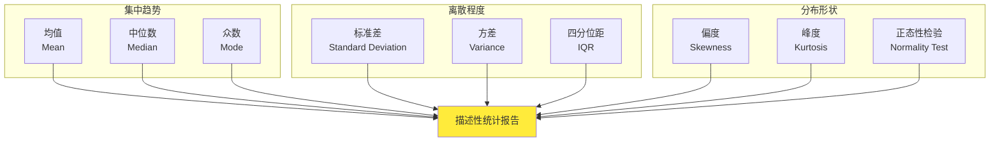

### 3.2 推断性统计分析层次

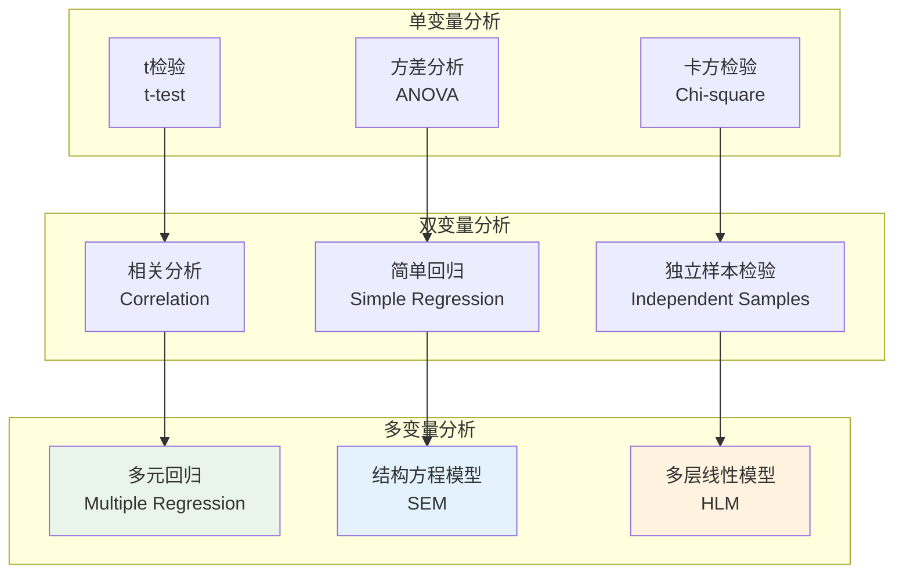

### 3.3 结构方程模型分析流程

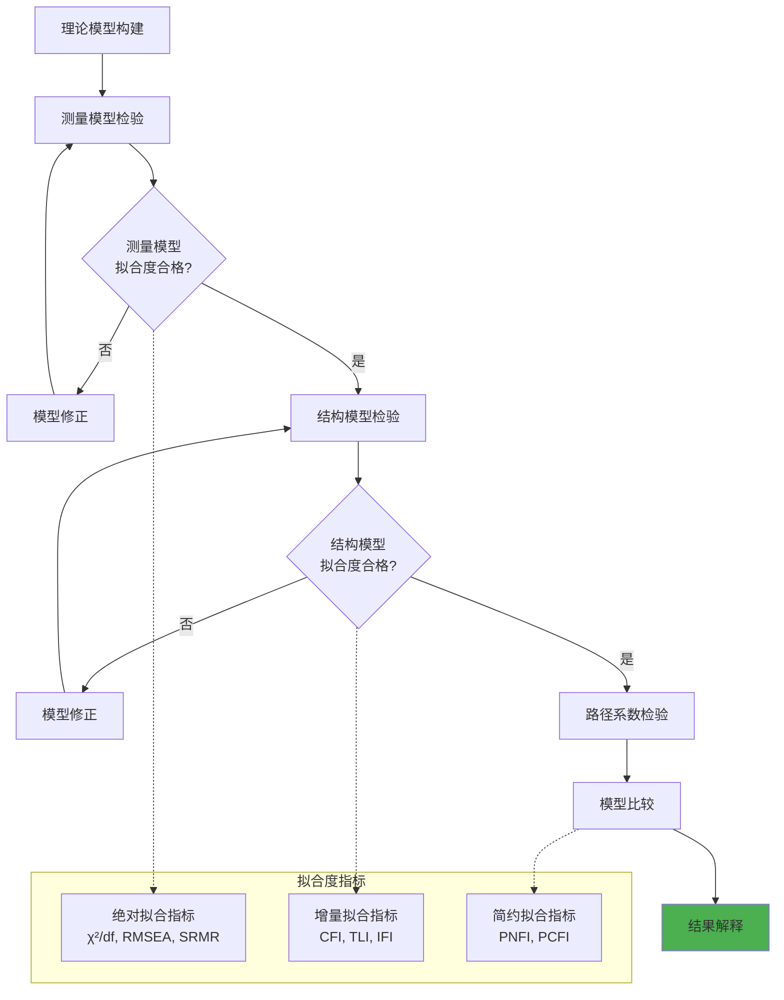

## 四、质性数据分析

### 4.1 主题分析流程

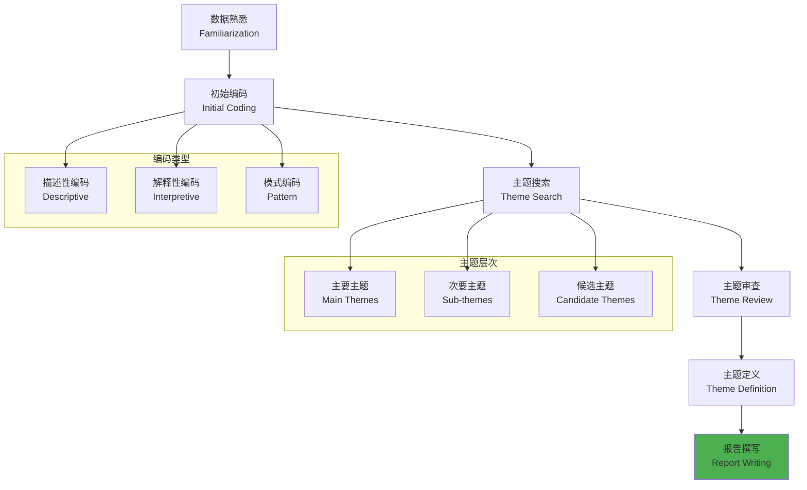

### 4.2 扎根理论分析过程

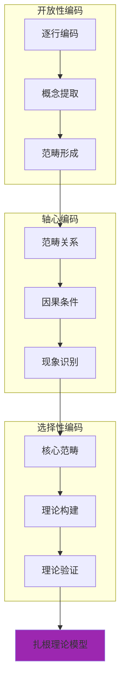

## 五、信效度检验

### 5.1 信度检验体系

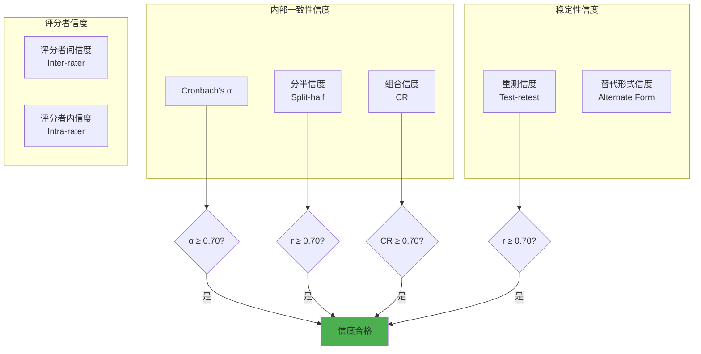

### 5.2 效度检验框架

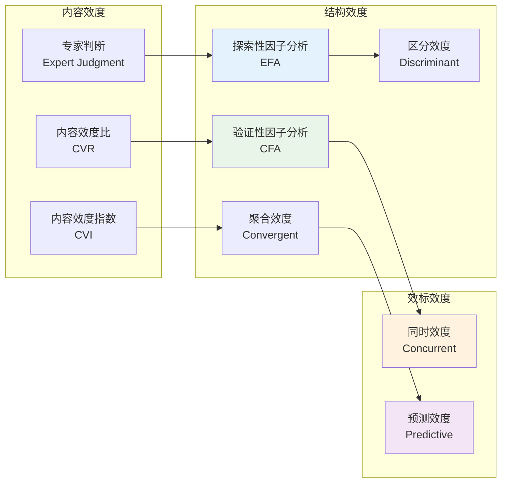

## 六、研究伦理与质量控制

### 6.1 研究伦理框架

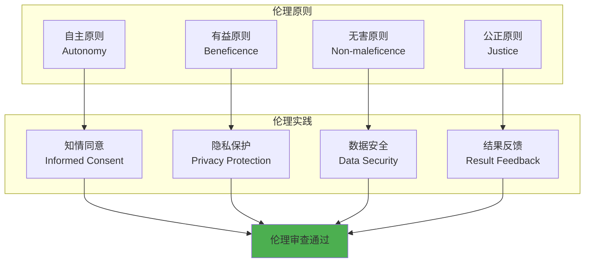

### 6.2 质量控制体系

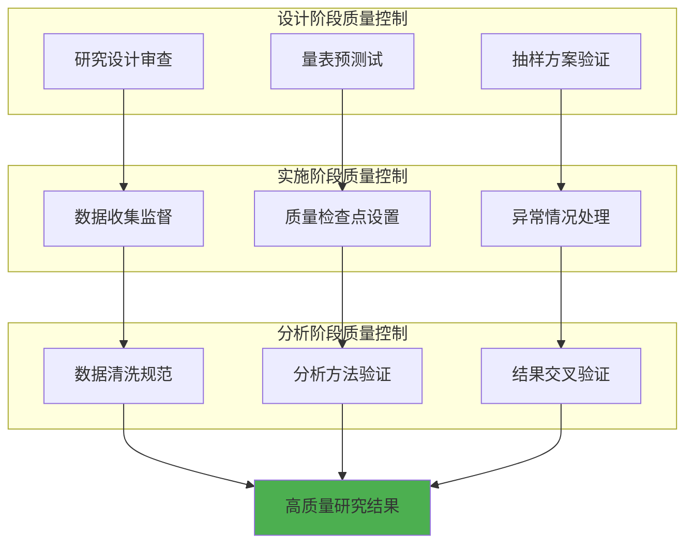

## 七、研究报告撰写

### 7.1 学术论文结构

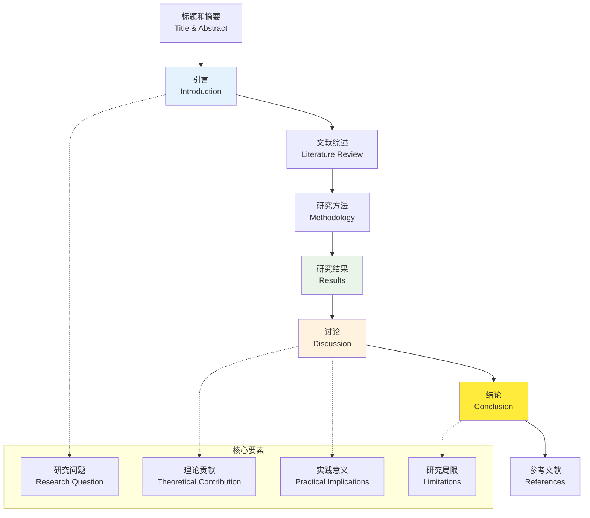

### 7.2 研究报告质量评估

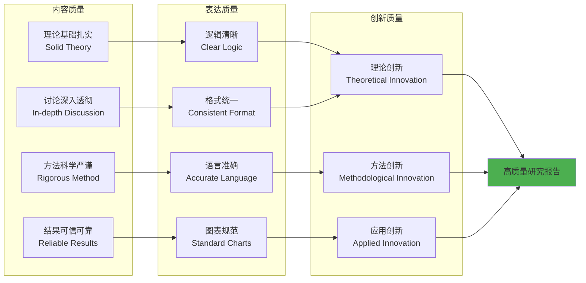

## 八、研究方法选择决策树

### 8.1 研究方法选择流程

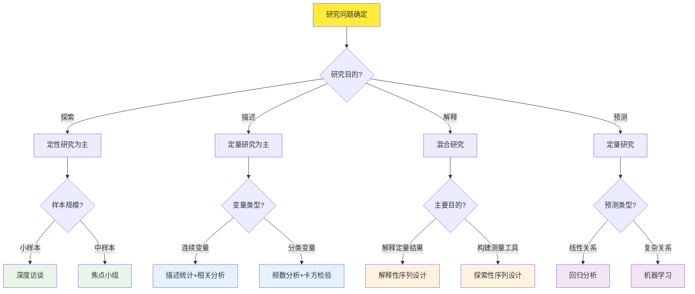

### 8.2 统计方法选择指南

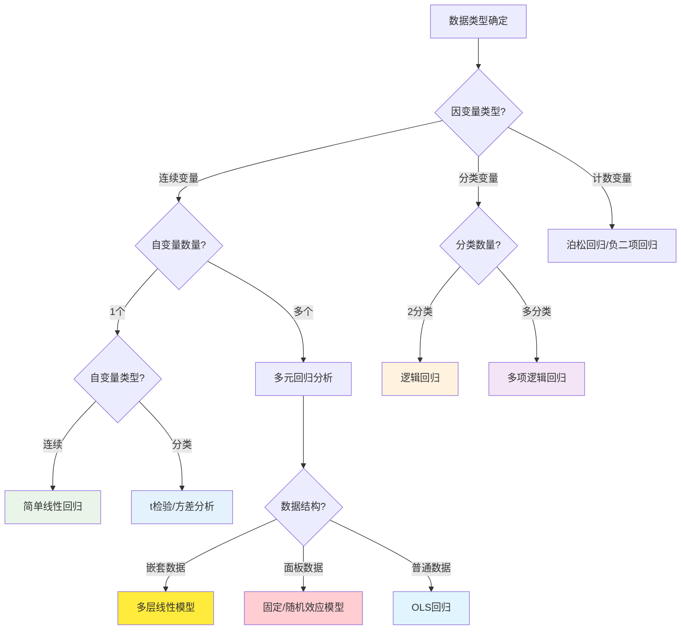

这个研究方法论文档提供了TAT理论研究的完整方法论框架，包含了从研究设计到结果报告的全过程指导，所有图表都使用Mermaid格式以确保在HTML中正确显示。