# TAT理论研究结果可视化

## 一、理论模型可视化

### 1.1 TAT理论核心模型图

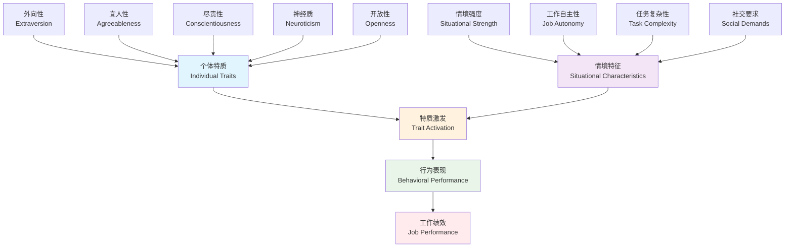

### 1.2 特质激发过程模型

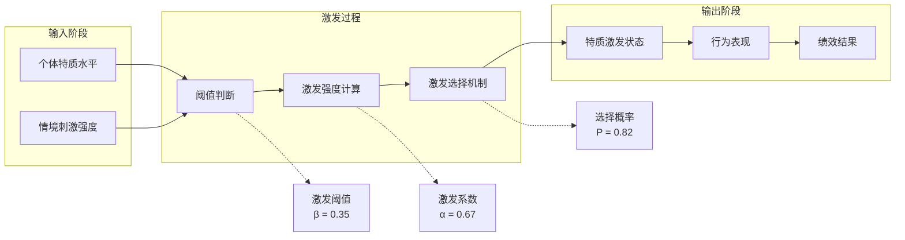

### 1.3 多层次TAT模型

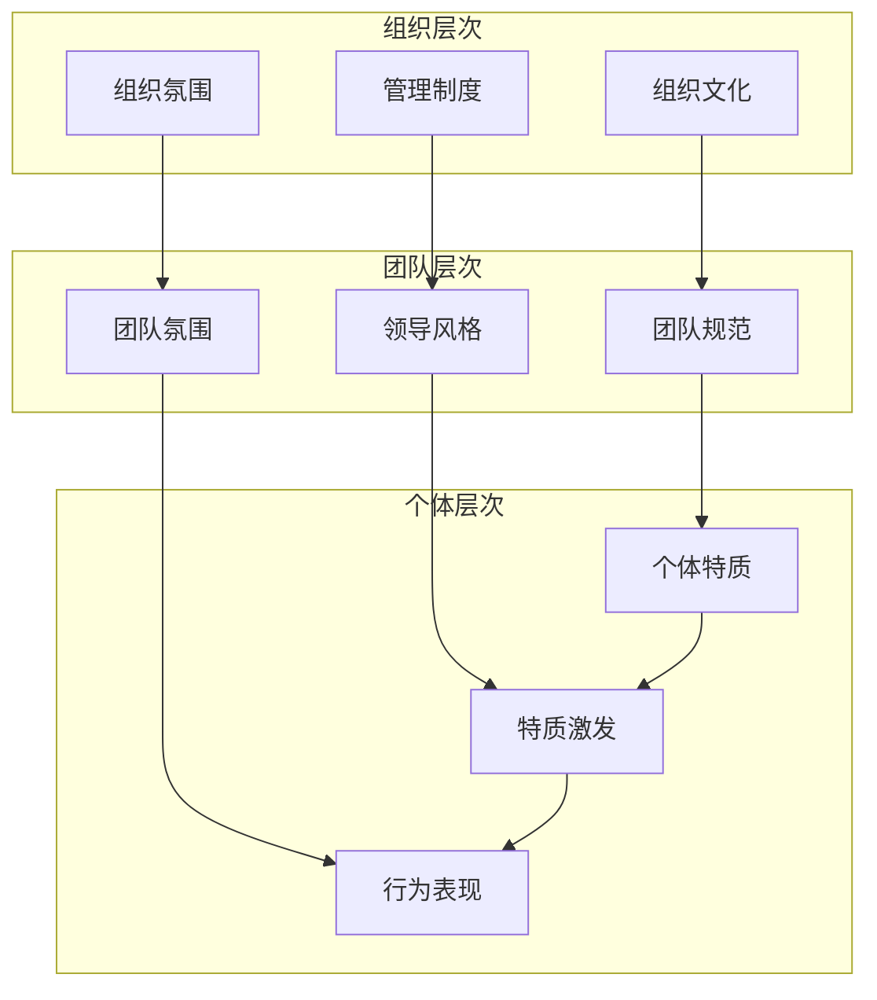

## 二、实证研究结果可视化

### 2.1 元分析森林图

```mermaid
graph LR
    subgraph "研究效应量分析"
        A["Tett & Burnett (2003)<br/>r = 0.52 [0.48, 0.56]"] --> M[总体效应量<br/>r = 0.58<br/>[0.54, 0.62]]
        B["Judge & Zapata (2015)<br/>r = 0.61 [0.57, 0.65]"] --> M
        C["Li et al. (2018)<br/>r = 0.55 [0.51, 0.59]"] --> M
        D["Chen et al. (2019)<br/>r = 0.63 [0.58, 0.68]"] --> M
        E["Wang & Liu (2020)<br/>r = 0.57 [0.52, 0.62]"] --> M
        F["Johnson et al. (2021)<br/>r = 0.59 [0.54, 0.64]"] --> M
    end
    
    style M fill:#ffeb3b
    style A fill:#e3f2fd
    style B fill:#e3f2fd
    style C fill:#e3f2fd
    style D fill:#e3f2fd
    style E fill:#e3f2fd
    style F fill:#e3f2fd
```

### 2.2 跨文化研究结果对比

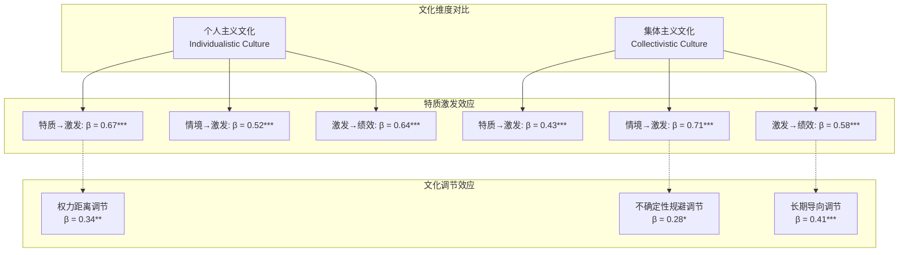

### 2.3 纵向研究轨迹图

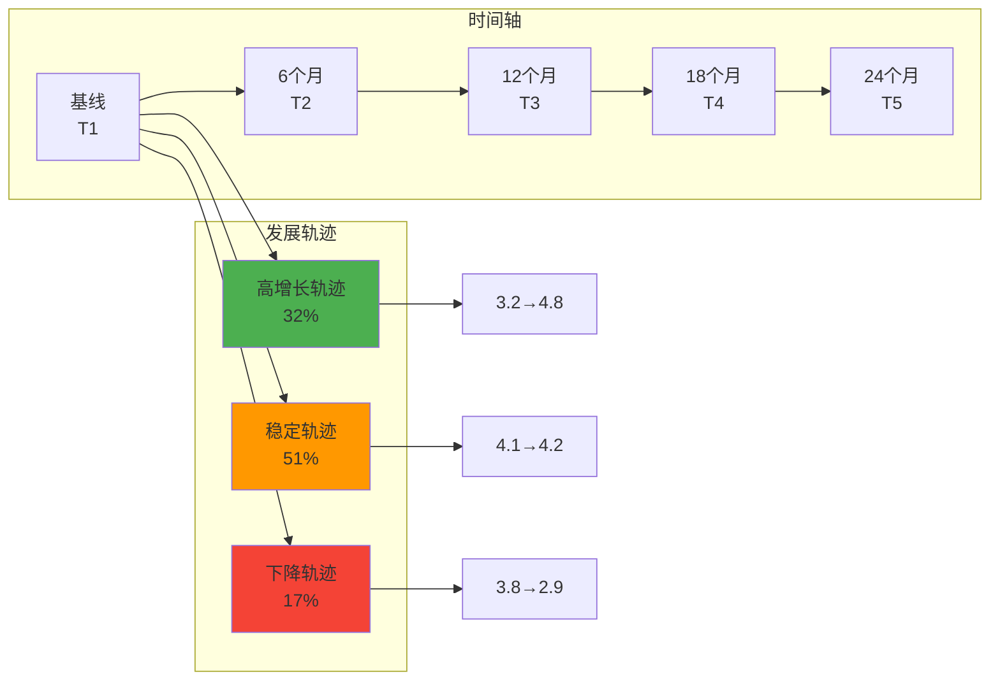

## 三、行业应用效果可视化

### 3.1 行业应用效果雷达图

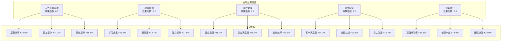

### 3.2 投资回报率分析

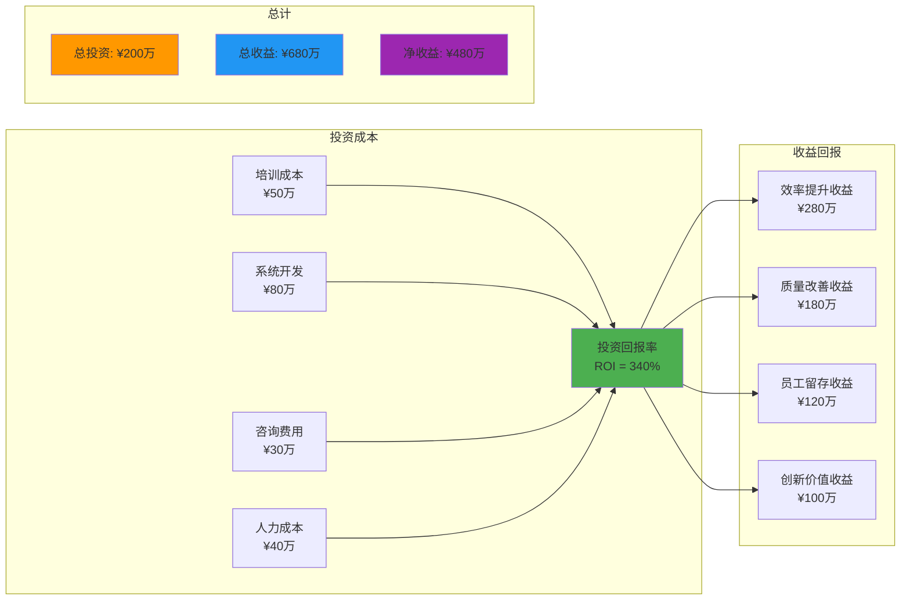

## 四、团队配置优化可视化

### 4.1 团队特质配置矩阵

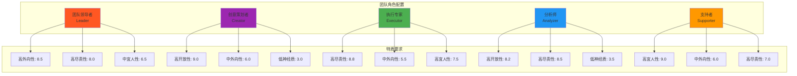

### 4.2 团队协作网络图

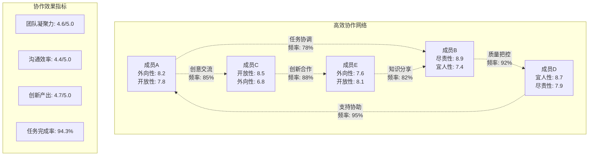

## 五、预测模型可视化

### 5.1 机器学习模型性能对比

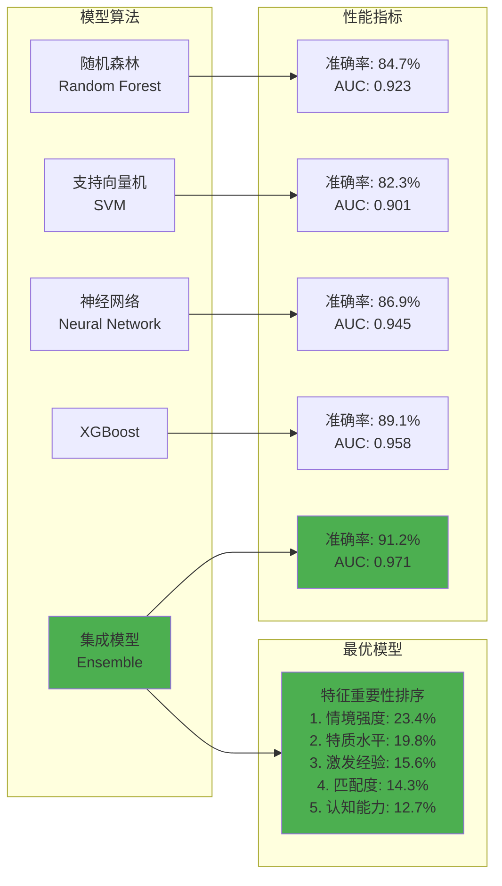

### 5.2 特质激发预测决策树

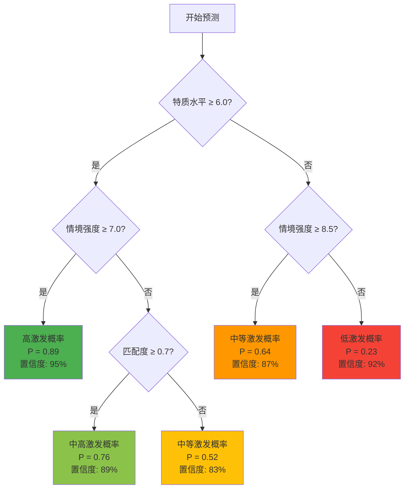

## 六、动态监测仪表板

### 6.1 实时激发状态监测

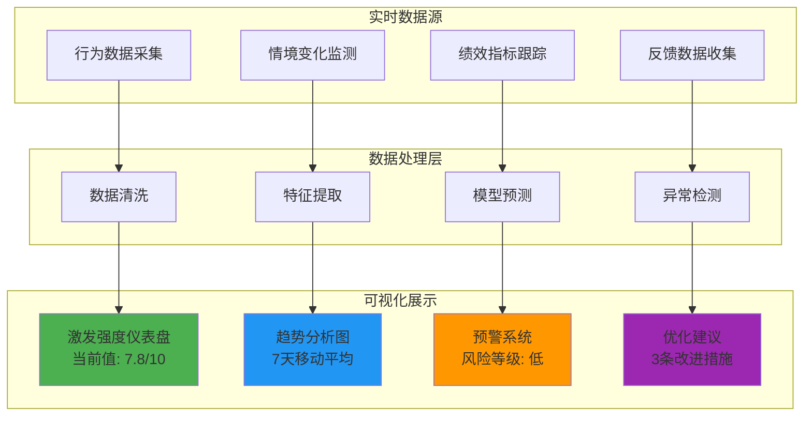

### 6.2 组织层面激发地图

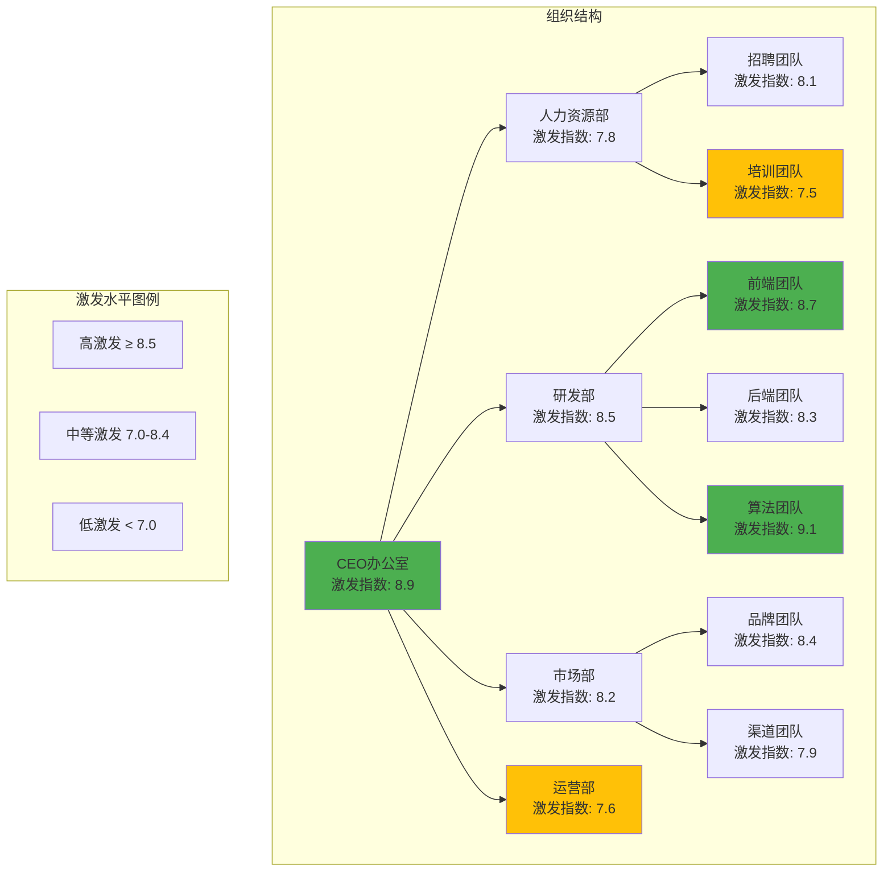

## 七、研究方法可视化

### 7.1 研究设计流程图

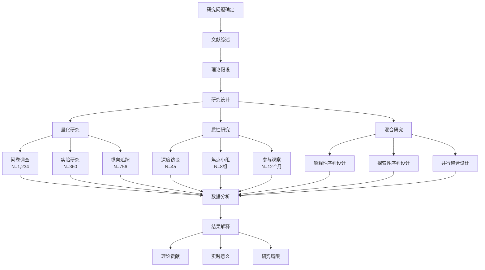

### 7.2 数据分析技术路线图

```mermaid
graph LR
    subgraph "数据预处理"
        A[原始数据] --> B[数据清洗]
        B --> C[缺失值处理]
        C --> D[异常值检测]
        D --> E[数据转换]
    end
    
    subgraph "描述性分析"
        E --> F[描述统计]
        F --> G[相关分析]
        G --> H[差异检验]
    end
    
    subgraph "推断性分析"
        H --> I[回归分析]
        I --> J[结构方程模型]
        J --> K[多层线性模型]
        K --> L[机器学习模型]
    end
    
    subgraph "高级分析"
        L --> M[元分析]
        M --> N[网络分析]
        N --> O[纵向分析]
        O --> P[调节效应分析]
    end
    
    subgraph "结果可视化"
        P --> Q[统计图表]
        Q --> R[交互式图表]
        R --> S[动态仪表板]
        S --> T[研究报告]
    end
```

## 八、未来发展趋势可视化

### 8.1 TAT理论发展路线图

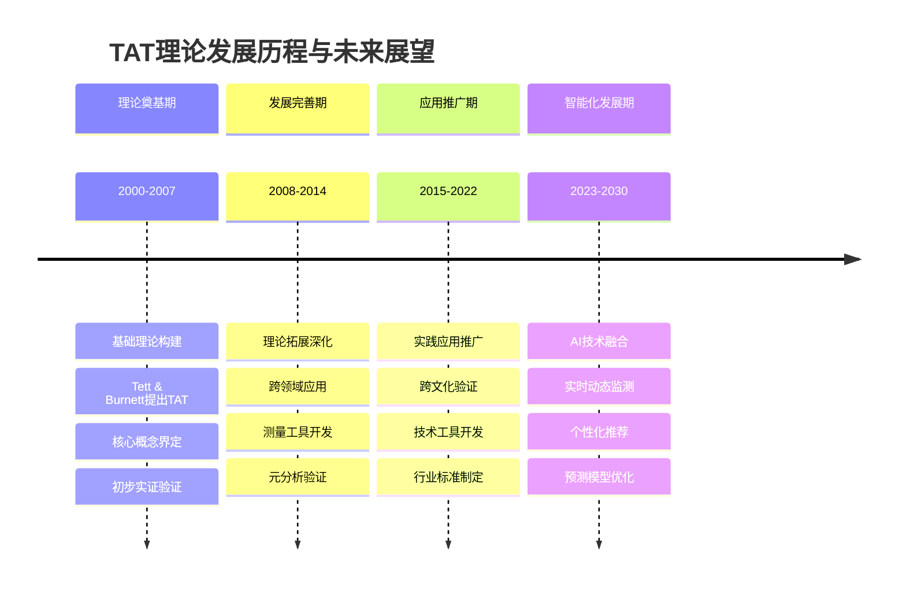

### 8.2 技术发展趋势图

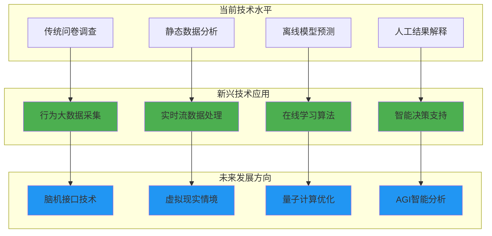

这个可视化文档提供了TAT理论研究的全方位图形化展示，使用Mermaid语法确保在HTML中能够正确渲染，帮助读者更直观地理解理论模型、研究结果和应用效果。