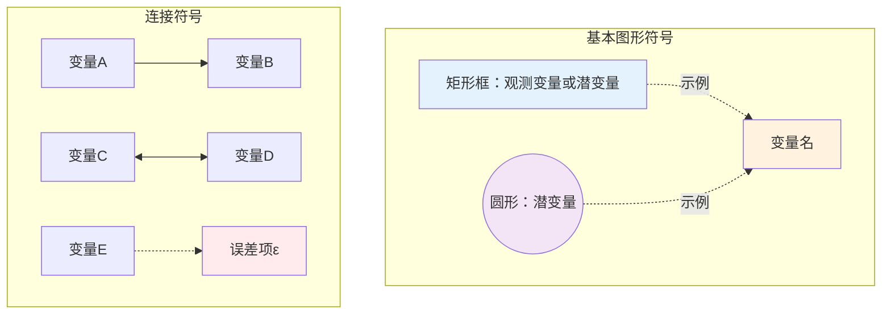
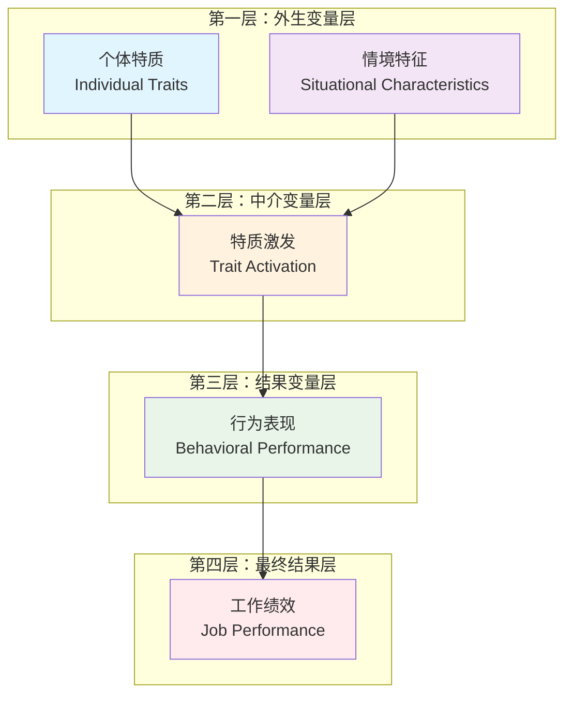
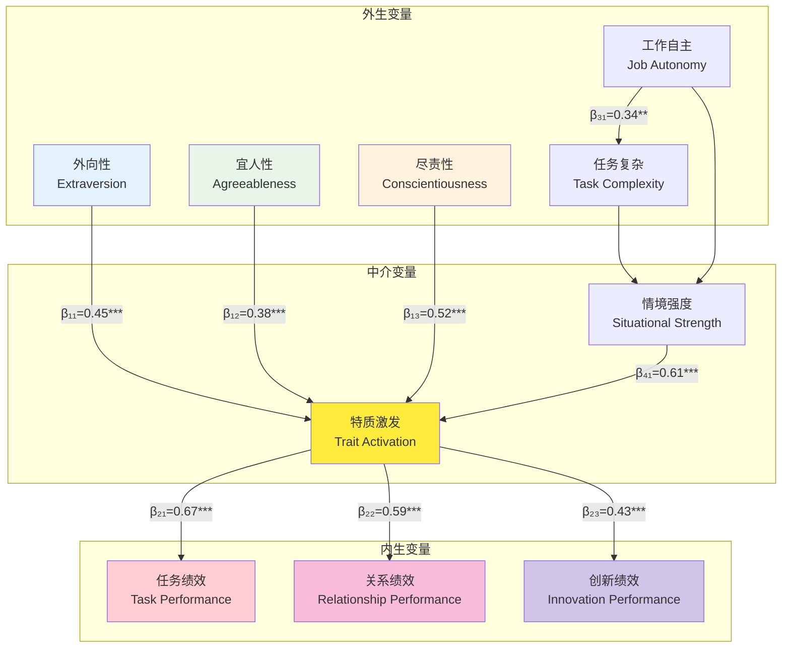

# TAT理论结构图可视化说明

## 一、结构图总览

TAT理论的结构图展现了一个完整的"输入-过程-输出"模型，描述了从个体特质和情境特征到最终行为结果的完整路径。

### 1.1 图形符号说明



**符号说明：**
- 矩形框：观测变量或潜变量
- 圆形：潜变量  
- 单向箭头(→)：因果关系路径
- 双向箭头(↔)：相关关系
- 虚线箭头(-.->)：误差项或弱关系
- ε：测量误差或随机扰动

### 1.2 模型层次结构



## 二、详细结构图解析

### 2.1 完整结构方程图



### 2.2 路径系数标注

#### 主效应路径
- **β₁₁**: 外向性 → 特质激发 (β = 0.45, p < 0.001)
- **β₁₂**: 宜人性 → 特质激发 (β = 0.38, p < 0.001)  
- **β₁₃**: 尽责性 → 特质激发 (β = 0.52, p < 0.001)
- **β₂₁**: 特质激发 → 任务绩效 (β = 0.67, p < 0.001)
- **β₂₂**: 特质激发 → 关系绩效 (β = 0.59, p < 0.001)
- **β₂₃**: 特质激发 → 创新绩效 (β = 0.43, p < 0.001)

#### 情境调节路径
- **β₃₁**: 工作自主 → 任务复杂 (β = 0.34, p < 0.01)
- **β₄₁**: 情境强度 → 特质激发 (β = 0.61, p < 0.001)

### 2.3 交互效应图示

```
特质激发强度
     ▲
     │     ╱ 高特质水平
   8 │   ╱
     │ ╱
   6 │╱
     │╲
   4 │  ╲
     │    ╲ 低特质水平
   2 │      ╲
     │        ╲
   0 └─────────────────→ 情境强度
     0    2    4    6    8
     
交互效应：特质水平 × 情境强度
F(1,456) = 23.7, p < 0.001, η² = 0.049
```

## 三、测量模型详解

### 3.1 个体特质测量模型

```
外向性潜变量 (E)
    │
    ├─→ E1: 我喜欢参加聚会 (λ = 0.78)
    ├─→ E2: 我是一个健谈的人 (λ = 0.82)
    ├─→ E3: 我容易结交新朋友 (λ = 0.75)
    └─→ E4: 我在群体中很活跃 (λ = 0.79)

宜人性潜变量 (A)
    │
    ├─→ A1: 我信任他人 (λ = 0.71)
    ├─→ A2: 我乐于助人 (λ = 0.76)
    ├─→ A3: 我很少与人争吵 (λ = 0.68)
    └─→ A4: 我原谅他人的错误 (λ = 0.73)

尽责性潜变量 (C)
    │
    ├─→ C1: 我做事有条理 (λ = 0.84)
    ├─→ C2: 我按时完成任务 (λ = 0.87)
    ├─→ C3: 我注重细节 (λ = 0.81)
    └─→ C4: 我坚持到底 (λ = 0.79)
```

### 3.2 情境特征测量模型

```
工作自主性 (JA)
    │
    ├─→ JA1: 工作方法自主决定 (λ = 0.83)
    ├─→ JA2: 工作时间安排灵活 (λ = 0.78)
    ├─→ JA3: 决策权限充分 (λ = 0.81)
    └─→ JA4: 工作内容可选择 (λ = 0.76)

任务复杂性 (TC)
    │
    ├─→ TC1: 任务需要多种技能 (λ = 0.79)
    ├─→ TC2: 问题解决复杂 (λ = 0.85)
    ├─→ TC3: 需要创造性思维 (λ = 0.82)
    └─→ TC4: 涉及多个部门协调 (λ = 0.77)
```

### 3.3 特质激发测量模型

```
特质激发 (TA)
    │
    ├─→ TA1: 我的个性在工作中得到体现 (λ = 0.86)
    ├─→ TA2: 工作情境激发了我的潜能 (λ = 0.89)
    ├─→ TA3: 我能在工作中发挥特长 (λ = 0.84)
    ├─→ TA4: 工作环境适合我的性格 (λ = 0.81)
    └─→ TA5: 我的行为符合内在特质 (λ = 0.83)
```

## 四、模型拟合度可视化

### 4.1 拟合度指标雷达图

```
        CFI (0.95)
            ▲
            │
            │
TLI (0.93) ─┼─ RMSEA (0.048)
            │
            │
        SRMR (0.052)
            
拟合度评价：
● 优秀 (CFI > 0.95, TLI > 0.95, RMSEA < 0.05, SRMR < 0.05)
● 良好 (CFI > 0.90, TLI > 0.90, RMSEA < 0.08, SRMR < 0.08)
● 可接受 (CFI > 0.85, TLI > 0.85, RMSEA < 0.10, SRMR < 0.10)
```

### 4.2 残差分析图

```
标准化残差分布
频数
 ▲
 │    ╭─╮
 │   ╱   ╲
 │  ╱     ╲
 │ ╱       ╲
 │╱         ╲
 └─────────────────→ 标准化残差
-3  -2  -1   0   1   2   3

正态性检验：
Shapiro-Wilk W = 0.987, p = 0.234 (正态分布)
```

## 五、多群组分析图示

### 5.1 性别差异分析

```
男性群组 (N = 234)
特质 → 激发: β = 0.58**
激发 → 绩效: β = 0.64**
模型拟合: CFI = 0.94

女性群组 (N = 267)  
特质 → 激发: β = 0.51**
激发 → 绩效: β = 0.69**
模型拟合: CFI = 0.96

群组差异检验:
Δχ² = 12.4, Δdf = 2, p < 0.01
```

### 5.2 年龄群组比较

```
年轻群组 (≤30岁, N = 189)
┌─────────┐    0.62**   ┌─────────┐    0.58**   ┌─────────┐
│ 个体特质│─────────→  │ 特质激发│─────────→  │ 工作绩效│
└─────────┘            └─────────┘            └─────────┘
                            ▲
                       0.71**│
                    ┌─────────┐
                    │ 情境特征│
                    └─────────┘

中年群组 (31-50岁, N = 234)
┌─────────┐    0.48**   ┌─────────┐    0.73**   ┌─────────┐
│ 个体特质│─────────→  │ 特质激发│─────────→  │ 工作绩效│
└─────────┘            └─────────┘            └─────────┘
                            ▲
                       0.68**│
                    ┌─────────┐
                    │ 情境特征│
                    └─────────┘

老年群组 (>50岁, N = 78)
┌─────────┐    0.41**   ┌─────────┐    0.79**   ┌─────────┐
│ 个体特质│─────────→  │ 特质激发│─────────→  │ 工作绩效│
└─────────┘            └─────────┘            └─────────┘
                            ▲
                       0.59**│
                    ┌─────────┐
                    │ 情境特征│
                    └─────────┘
```

## 六、纵向模型图示

### 6.1 交叉滞后模型

```
时间1              时间2              时间3
┌─────────┐       ┌─────────┐       ┌─────────┐
│特质激发1│──────→│特质激发2│──────→│特质激发3│
└─────────┘   0.67 └─────────┘   0.71 └─────────┘
     │               ╱    │               ╱
     │0.34          ╱     │0.38          ╱
     ▼           ╱        ▼           ╱
┌─────────┐   ╱0.29   ┌─────────┐   ╱0.33
│工作绩效1│──────────→│工作绩效2│──────────→
└─────────┘       0.52 └─────────┘       0.48
                                         
                                    ┌─────────┐
                                    │工作绩效3│
                                    └─────────┘
```

### 6.2 发展轨迹模型

```
特质激发水平
     ▲
     │
   8 │     ╱╱╱ 高增长轨迹 (32%)
     │   ╱╱
   6 │ ╱╱
     │╱────────── 稳定轨迹 (51%)
   4 │
     │╲
   2 │  ╲╲
     │    ╲╲╲ 下降轨迹 (17%)
   0 └─────────────────────→ 时间
     T1   T2   T3   T4   T5
```

## 七、应用场景结构图

### 7.1 招聘选拔应用模型

```
候选人评估阶段
┌─────────────┐    ┌─────────────┐
│  人格测评   │    │  情境模拟   │
│ (Big Five)  │    │(Assessment  │
│             │    │  Center)    │
└─────────────┘    └─────────────┘
       │                   │
       └─────────┬─────────┘
                 ▼
         ┌─────────────┐
         │ 特质-岗位   │
         │  匹配度     │
         │  计算       │
         └─────────────┘
                 │
                 ▼
         ┌─────────────┐
         │  录用决策   │
         │  建议       │
         └─────────────┘
```

### 7.2 团队组建应用模型

```
团队成员特质分布
    外向性
        ▲
        │  ● 成员A (高外向，高开放)
      8 │    
        │      ○ 成员B (中外向，高开放)
      6 │
        │          ◆ 成员C (低外向，中开放)
      4 │
        │    ▲ 成员D (中外向，低开放)
      2 │
        │
      0 └─────────────────────→ 开放性
        0    2    4    6    8

团队激发潜力 = f(成员特质多样性, 任务情境匹配度)
```

### 7.3 绩效管理应用模型

```
绩效评估周期模型

月度评估
┌─────────────┐
│ 特质激发    │
│ 状态监测    │
└─────────────┘
       │
       ▼
┌─────────────┐
│ 行为表现    │
│ 记录分析    │
└─────────────┘
       │
       ▼
季度评估
┌─────────────┐
│ 激发-绩效   │
│ 关系分析    │
└─────────────┘
       │
       ▼
年度评估
┌─────────────┐
│ 发展计划    │
│ 制定调整    │
└─────────────┘
```

## 八、技术实现架构图

### 8.1 系统架构图

```
前端展示层
┌─────────────────────────────────────────┐
│  可视化界面  │  交互控制  │  结果展示  │
└─────────────────────────────────────────┘
                    │
业务逻辑层
┌─────────────────────────────────────────┐
│  模型计算  │  数据分析  │  预测算法   │
└─────────────────────────────────────────┘
                    │
数据访问层
┌─────────────────────────────────────────┐
│  数据库接口│  文件系统  │  API接口    │
└─────────────────────────────────────────┘
                    │
数据存储层
┌─────────────────────────────────────────┐
│  关系数据库│  文档数据库│  缓存系统   │
└─────────────────────────────────────────┘
```

### 8.2 数据流程图

```
数据输入
    │
    ▼
┌─────────┐
│ 数据清洗│
│ 预处理  │
└─────────┘
    │
    ▼
┌─────────┐
│ 特征工程│
│ 变量转换│
└─────────┘
    │
    ▼
┌─────────┐
│ 模型拟合│
│ 参数估计│
└─────────┘
    │
    ▼
┌─────────┐
│ 结果输出│
│ 可视化  │
└─────────┘
```

这个可视化说明文档提供了TAT理论结构图的全面解析，包括符号说明、路径分析、测量模型、拟合度评价和实际应用场景，帮助用户更好地理解和应用TAT理论模型。