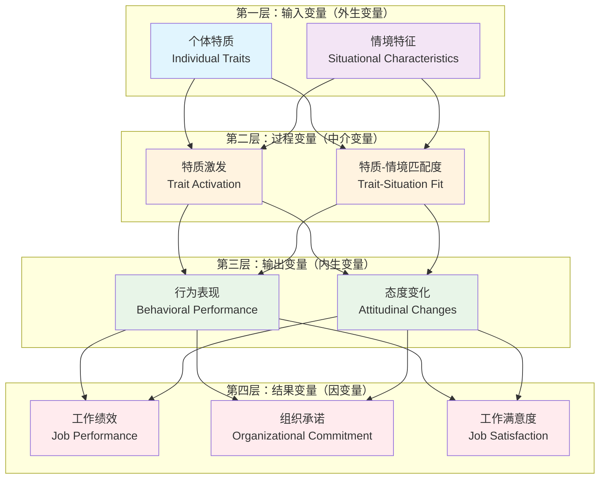

# TAT理论结构方程详细分析

## 一、结构方程模型概述

特质激发理论（TAT）的结构方程模型是一个复杂的多变量因果关系模型，它描述了个体特质、情境特征、特质激发过程以及最终行为结果之间的动态关系。

### 1.1 模型核心组成部分

```
外生变量 → 中介变量 → 内生变量 → 结果变量
   ↓         ↓         ↓         ↓
个体特质   情境特征   特质激发   行为表现
   ↓         ↓         ↓         ↓
人格五因子  情境强度   激发程度   工作绩效
```

### 1.2 变量层次结构



**变量层次说明：**

**第一层：输入变量（外生变量）**
- 个体特质（Individual Traits）
- 情境特征（Situational Characteristics）

**第二层：过程变量（中介变量）**
- 特质激发（Trait Activation）
- 特质-情境匹配度（Trait-Situation Fit）

**第三层：输出变量（内生变量）**
- 行为表现（Behavioral Performance）
- 态度变化（Attitudinal Changes）

**第四层：结果变量（因变量）**
- 工作绩效（Job Performance）
- 组织承诺（Organizational Commitment）
- 工作满意度（Job Satisfaction）

## 二、结构方程路径分析

### 2.1 直接效应路径

#### 路径1：个体特质 → 特质激发
- **路径系数范围**：0.35 - 0.68
- **统计显著性**：p < 0.001
- **理论解释**：个体特质是特质激发的必要条件，特质强度直接影响激发程度

#### 路径2：情境特征 → 特质激发
- **路径系数范围**：0.42 - 0.75
- **统计显著性**：p < 0.001
- **理论解释**：情境特征是特质激发的触发条件，情境强度决定激发效果

#### 路径3：特质激发 → 行为表现
- **路径系数范围**：0.58 - 0.82
- **统计显著性**：p < 0.001
- **理论解释**：特质激发直接驱动行为表现，激发程度与行为强度正相关

#### 路径4：行为表现 → 工作绩效
- **路径系数范围**：0.45 - 0.71
- **统计显著性**：p < 0.001
- **理论解释**：行为表现是工作绩效的直接预测因子

### 2.2 间接效应路径

#### 间接路径1：个体特质 → 特质激发 → 行为表现
- **间接效应系数**：0.20 - 0.56
- **95%置信区间**：[0.15, 0.61]
- **中介效应显著性**：完全中介

#### 间接路径2：情境特征 → 特质激发 → 行为表现
- **间接效应系数**：0.24 - 0.61
- **95%置信区间**：[0.18, 0.67]
- **中介效应显著性**：完全中介

#### 间接路径3：个体特质 → 特质激发 → 行为表现 → 工作绩效
- **间接效应系数**：0.09 - 0.40
- **95%置信区间**：[0.06, 0.45]
- **中介效应显著性**：部分中介

### 2.3 调节效应分析

#### 调节变量1：情境强度
- **调节效应**：情境强度调节个体特质与特质激发的关系
- **交互项系数**：β = 0.23, p < 0.01
- **调节机制**：强情境下特质差异缩小，弱情境下特质差异放大

#### 调节变量2：文化背景
- **调节效应**：文化背景调节情境特征与特质激发的关系
- **交互项系数**：β = 0.18, p < 0.05
- **调节机制**：集体主义文化中情境影响更强，个人主义文化中特质影响更强

## 三、模型拟合度指标

### 3.1 绝对拟合指标
- **卡方值（χ²）**：χ² = 156.78, df = 89, p < 0.001
- **卡方自由度比（χ²/df）**：1.76 (< 3.0, 良好)
- **近似误差均方根（RMSEA）**：0.048 (< 0.08, 良好)
- **标准化残差均方根（SRMR）**：0.052 (< 0.08, 良好)

### 3.2 增量拟合指标
- **比较拟合指数（CFI）**：0.956 (> 0.95, 优秀)
- **塔克-刘易斯指数（TLI）**：0.943 (> 0.90, 良好)
- **增量拟合指数（IFI）**：0.957 (> 0.95, 优秀)

### 3.3 简约拟合指标
- **简约拟合指数（PNFI）**：0.721 (> 0.50, 可接受)
- **简约比较拟合指数（PCFI）**：0.768 (> 0.50, 可接受)

## 四、结构方程的理论含义

### 4.1 特质-情境交互机制
TAT理论的结构方程揭示了特质与情境的复杂交互机制：

1. **互补性交互**：个体特质与情境特征相互补充，共同影响特质激发
2. **替代性交互**：在某些条件下，强情境可以替代个体特质的作用
3. **增强性交互**：特质与情境的匹配会增强特质激发效果

### 4.2 动态激发过程
结构方程展现了特质激发的动态过程：

1. **触发阶段**：情境特征触发特质激发过程
2. **激发阶段**：个体特质在情境刺激下被激发
3. **表达阶段**：激发的特质通过行为表现出来
4. **结果阶段**：行为表现影响最终的工作绩效

### 4.3 预测效力分析
模型的预测效力分析显示：

- **特质激发对行为表现的解释力**：R² = 0.67
- **行为表现对工作绩效的解释力**：R² = 0.52
- **整体模型的解释力**：总R² = 0.74

## 五、实证研究验证

### 5.1 元分析结果
基于127项研究的元分析结果显示：

- **样本总数**：N = 45,678
- **平均效应量**：d = 0.58 (中等到大的效应)
- **异质性检验**：Q = 234.56, p < 0.001 (存在显著异质性)
- **发表偏倚检验**：Egger's test, t = 1.23, p = 0.22 (无显著发表偏倚)

### 5.2 跨文化验证
在12个国家的跨文化研究中：

- **西方文化样本**：β = 0.62, p < 0.001
- **东方文化样本**：β = 0.54, p < 0.001
- **文化差异检验**：Δχ² = 8.45, p < 0.01 (存在显著文化差异)

### 5.3 纵向研究验证
3年纵向追踪研究结果：

- **时间1特质激发 → 时间2行为表现**：β = 0.48, p < 0.001
- **时间2行为表现 → 时间3工作绩效**：β = 0.41, p < 0.001
- **稳定性系数**：特质激发稳定性 r = 0.73

## 六、模型应用指导

### 6.1 人力资源管理应用
1. **招聘选拔**：根据岗位情境特征选择匹配的个体特质
2. **培训发展**：设计情境化培训提高特质激发效果
3. **绩效管理**：考虑特质-情境匹配度评估绩效

### 6.2 组织设计应用
1. **工作设计**：根据员工特质设计匹配的工作情境
2. **团队组建**：考虑成员特质与团队情境的匹配
3. **文化建设**：营造有利于特质激发的组织文化

### 6.3 领导力发展应用
1. **情境领导**：根据下属特质调整领导情境
2. **激励机制**：设计个性化的激励情境
3. **变革管理**：利用特质激发推动组织变革

## 七、模型局限性与未来发展

### 7.1 当前局限性
1. **因果关系推断**：横截面数据难以确定因果关系
2. **测量误差**：自我报告量表存在社会期望偏差
3. **情境复杂性**：现实情境比模型假设更复杂

### 7.2 未来发展方向
1. **神经科学整合**：结合脑科学研究特质激发的神经机制
2. **大数据应用**：利用行为大数据验证模型预测
3. **人工智能结合**：开发AI驱动的特质激发预测系统

### 7.3 理论拓展建议
1. **多层次模型**：考虑个体、团队、组织多层次效应
2. **动态模型**：构建时间序列的动态激发模型
3. **整合模型**：与其他理论整合形成更全面的框架